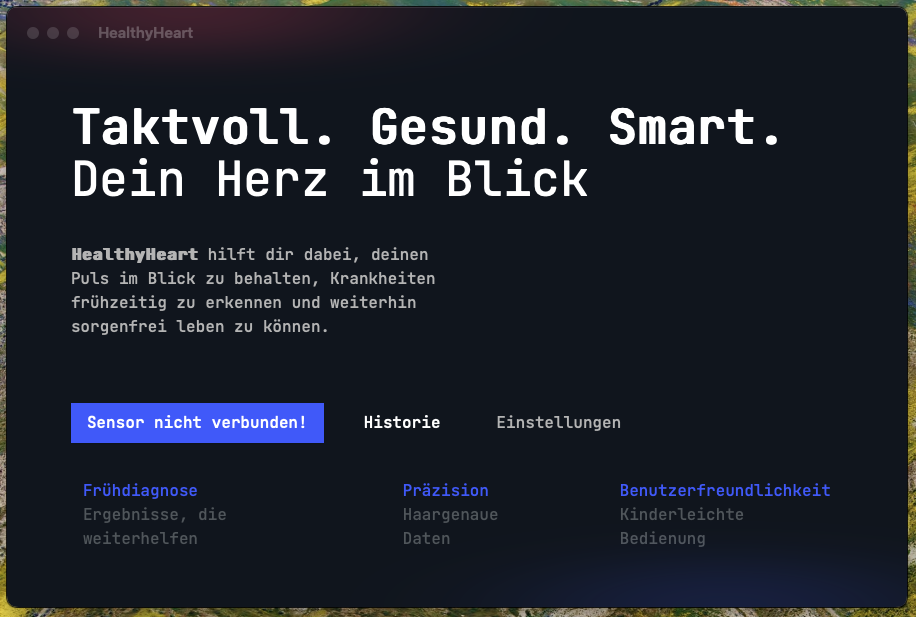

# HealthyHeart - ein moderner Herzschrittmesser

HealthyHeart ist eine moderne software für die Auswertung von Herzfrequenzdaten.

Die Herzfrequenz kann in dem Programm mittels eines Arduino und eines Sensors ermittelt werden.

## Tech-Stack

Die App wurde mit [Wails](https://wails.io) gebaut, das "backend" dementsprechend in Golang.
Die UI wurde mit [Vue](https://vuejs.org/) und [Tailwind](https://tailwindcss.com) gebaut. Das design war ebenfalls Teil des Projekts.

## Screenshots

